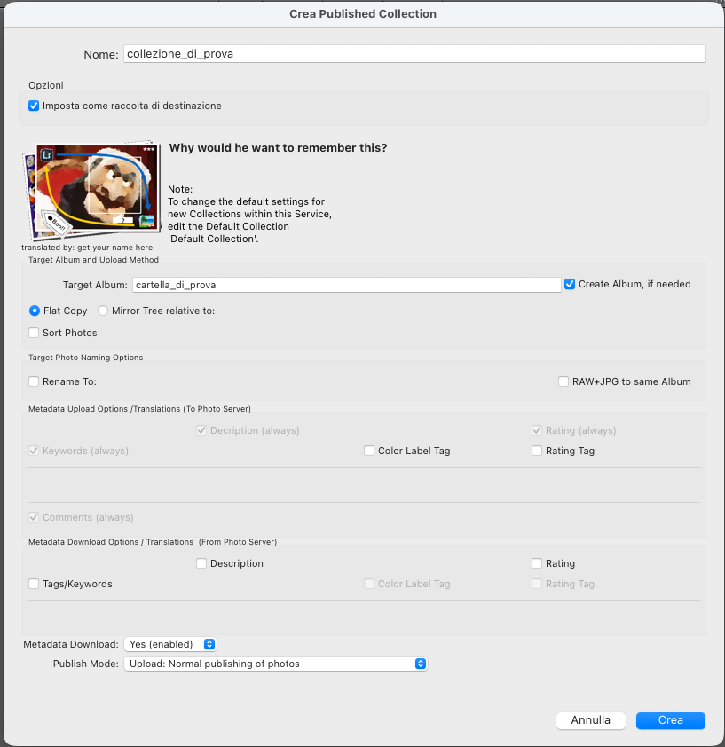
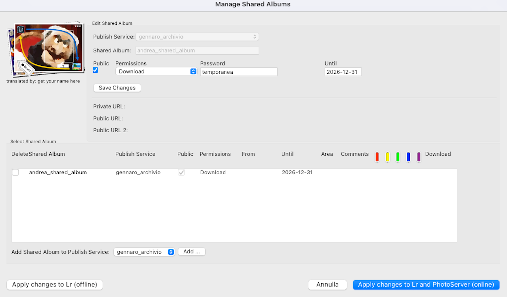
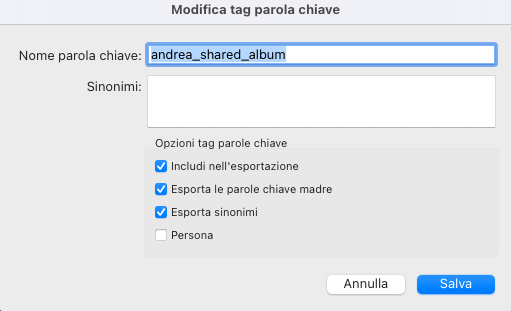
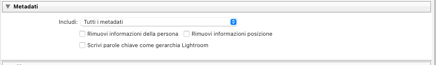

# Guida Completa alla Gestione degli Shared Albums in Photo StatLr

## 📑 Indice

1. [Introduzione](#introduzione)
2. [Prerequisiti](#prerequisiti)
3. [Concetti Base](#concetti-base)
4. [Setup Iniziale](#setup-iniziale)
5. [Creare una Published Collection](#creare-una-published-collection)
6. [Creare uno Shared Album](#creare-uno-shared-album)
7. [Configurare la Keyword in Lightroom](#configurare-la-keyword-in-lightroom)
8. [Configurazione Metadati per Shared Albums](#configurazione-metadati-per-shared-albums)
9. [Pubblicare Foto nello Shared Album](#pubblicare-foto-nello-shared-album)
10. [Gestire e Modificare Shared Albums](#gestire-e-modificare-shared-albums)
11. [Best Practices](#best-practices)
12. [Troubleshooting](#troubleshooting)
13. [FAQ - Domande Frequenti](#faq---domande-frequenti)

---

## Introduzione

Gli **Shared Albums** (Album Condivisi) in Synology Photos sono collezioni virtuali di foto che possono essere condivise pubblicamente o mantenute private. Con Photo StatLr puoi gestire questi album direttamente da Lightroom utilizzando un sistema di **keywords** (parole chiave).

### Cosa Sono gli Shared Albums

- 📁 **Album Virtuali**: Non sono cartelle fisiche, ma collezioni di riferimenti a foto
- 🔗 **Condivisibili**: Possono essere resi pubblici con link condivisibili
- 🔐 **Protetti**: Possono essere protetti con password e date di scadenza
- 🖼️ **Multi-collezione**: Una stessa foto può stare in più Shared Albums

### Differenza tra Folder e Shared Album

| Caratteristica | Folder (Cartella) | Shared Album |
|----------------|-------------------|--------------|
| **Tipo** | Struttura fisica su disco | Collezione virtuale |
| **Ubicazione** | Percorso fisico sul NAS | Database Synology Photos |
| **Contenuto** | File reali nella directory | Riferimenti a foto da varie cartelle |
| **Condivisione** | Tramite permessi cartella | Link pubblico diretto con password |
| **Gestione** | Via Lightroom Target Album | Via Keywords + Dialog Manager |

---

## Prerequisiti

### Software Richiesto

- ✅ Adobe Lightroom Classic 7.0+ (o Lightroom 4.0-6.14)
- ✅ Photo StatLr Plugin 5.0+
- ✅ Synology Photos 1.0+ o Photo Station 6.6+

**⚠️ Differenze tra Photo Station e Synology Photos:**

| Feature | Photo Station 6.7-6.8 | Synology Photos 1.0-1.8 |
|---------|----------------------|------------------------|
| **Shared Albums Base** | ✅ Completamente supportato | ✅ Completamente supportato |
| **Opzioni Avanzate** (From, Area Tool, Comments, Color Labels) | ✅ Disponibili | ❌ **Non disponibili** |
| **Stato del Software** | ⚠️ Deprecato da Synology | ✅ Software attuale |

**Nota**: Synology ha deprecato Photo Station in favore di Synology Photos. Le opzioni avanzate degli Shared Albums sono disponibili solo con Photo Station 6.7+, ma non vale la pena tornare indietro per queste funzionalità.

### Configurazione Iniziale

1. **Publish Service Configurato**: Devi avere già configurato un Publish Service di Photo StatLr
2. **Foto Già Pubblicate**: È consigliabile avere già pubblicato le foto nelle cartelle fisiche
3. **Accesso al NAS**: Credenziali valide per Synology Photos/Photo Station

---

## Concetti Base

### Come Funziona il Sistema

```
┌─────────────────────────────────────────────────────────────┐
│                    LIGHTROOM                                │
│                                                             │
│  Keywords (Parole Chiave)                                   │
│  └── Photo StatLr                                           │
│      └── Shared Albums                                      │
│          └── <Nome Publish Service>                         │
│              └── <Nome Shared Album> ← Assegni alle foto    │
│                                                             │
│  ↓ PUBLISH (con foto che hanno la keyword)                  │
└─────────────────────────────────────────────────────────────┘
                            ↓
┌─────────────────────────────────────────────────────────────┐
│                  SYNOLOGY PHOTOS                            │
│                                                             │
│  Cartelle Fisiche:                                          │
│  /Famiglia/2024/foto_001.jpg ────┐                          │
│  /Viaggi/2024/foto_002.jpg ──────┼─→ Shared Album          │
│                                   │   "Best Photos 2024"    │
│  (foto esistono fisicamente)      │   (contiene link)       │
│                                   │                         │
│  Link pubblico: https://nas.com/mo/sharing/xyz123           │
└─────────────────────────────────────────────────────────────┘
```

### Workflow Generale

1. **Setup**: Il plugin crea automaticamente la gerarchia keywords base
2. **Creazione**: Crei lo Shared Album tramite il dialog manager
3. **Keyword**: Crei una keyword in Lightroom con il nome dell'album
4. **Assegnazione**: Assegni la keyword alle foto desiderate
5. **Pubblicazione**: Pubblichi le foto (il plugin aggiunge i link all'album)
6. **Condivisione**: Ottieni gli URL per condividere l'album

---

## Setup Iniziale

### Verifica Gerarchia Keywords

Quando crei o modifichi un Publish Service, Photo StatLr crea automaticamente questa gerarchia:

```
Photo StatLr
└── Shared Albums
    └── <Nome del tuo Publish Service>
```

**Come Verificare:**

1. Apri il pannello **Keywords** in Lightroom (`Ctrl+K` / `Cmd+K` su Windows/Mac)
2. Cerca la gerarchia `Photo StatLr > Shared Albums > <Nome Service>`
3. Se non esiste, procedi con il passo successivo

### Ricreazione Manuale (Se Necessario)

Se la gerarchia è stata cancellata:

**Metodo Automatico (Consigliato):**

1. Nel pannello **Publish Services** (a sinistra in Library)
2. Click destro sul tuo Publish Service → **Edit Settings...**
3. Clicca **Save** (anche senza modificare nulla)
4. La gerarchia verrà ricreata automaticamente

**Metodo Manuale:**

Se il metodo automatico non funziona:

1. Pannello **Keywords** → Click destro → **Create Keyword Tag**
2. Nome: `Photo StatLr` → Salva
3. Click destro su `Photo StatLr` → **Create Keyword Tag**
4. Nome: `Shared Albums` → Salva
5. Click destro su `Shared Albums` → **Create Keyword Tag**
6. Nome: `<Nome esatto del tuo Publish Service>` → Salva

---

## Creare una Published Collection

### Quando È Necessario

Prima di poter gestire Shared Albums, devi avere una **Published Collection** configurata. Una Published Collection è il container in Lightroom che tiene traccia delle foto pubblicate sul NAS.

**Quando crearla:**
- ✅ Prima volta che usi il plugin per pubblicare foto
- ✅ Quando vuoi organizzare foto in gruppi logici separati
- ✅ Per ogni "progetto" o categoria di foto distinta

**Nota**: Puoi avere multiple Published Collections nello stesso Publish Service.

### Creare la Collection

1. Pannello **Publish Services** (a sinistra in Library)
2. Espandi il tuo **Publish Service** di Photo StatLr
3. **Click destro** sul Publish Service → **Create Published Collection...**
4. Si apre il dialog di configurazione



### Configurazione della Published Collection

#### 1. Nome della Collection

```
Nome: collezione_di_prova
```

- Nome descrittivo in Lightroom (es: "Famiglia 2024", "Portfolio Clienti")
- **Non** influenza il nome delle cartelle sul NAS

**☑ Imposta come raccolta di destinazione**
- Rende questa collection il target per "Go to Target Collection" (`Cmd+Alt+Shift+B`)
- Consiglio: attiva solo per la collection principale

#### 2. Target Album (Configurazione Critica!)

```
Target Album: cartella_di_prova
☑ Create Album, if needed
```

**Target Album**: `cartella_di_prova`

Questo è il **percorso della cartella fisica** sul NAS dove verranno caricate le foto.

**Esempi di percorsi:**
```
"Famiglia/2024"              → /photo/Famiglia/2024/
"Viaggi/Europa/Italia"       → /photo/Viaggi/Europa/Italia/
"Portfolio/{Date YYYY}"      → /photo/Portfolio/2024/
"{LrCC:path}"                → Replica struttura Collection Lr
```

**☑ Create Album, if needed** ← **IMPORTANTE!**

✅ **Cosa fa**: Crea automaticamente la **cartella fisica** sul NAS se non esiste
❌ **Cosa NON fa**: NON crea uno Shared Album (album virtuale)

**⚠️ Attenzione alla Confusione Terminologica:**

Il termine "Album" nel plugin può significare cose diverse:
- In **Photo Station**: Album = cartella fisica
- In **Synology Photos**: Album = collezione virtuale
- In questo contesto: **"Create Album" = crea cartella fisica**

**Per creare Shared Albums** (album virtuali condivisi) devi usare le **keywords**, come spiegato nelle sezioni successive!

#### 3. Struttura Upload

**○ Flat Copy** (consigliato per Shared Albums)
```
Tutte le foto in un'unica cartella piatta
```

**Esempio:**
```
Lightroom (struttura locale):     Synology NAS:
├── 2024/                        cartella_di_prova/
│   ├── 01-Gennaio/              ├── IMG_001.jpg
│   │   └── IMG_001.jpg          ├── IMG_002.jpg
│   └── 02-Febbraio/             └── IMG_003.jpg
│       └── IMG_002.jpg
```

**○ Mirror Tree relative to:**
```
Replica la struttura di cartelle locali
```

**Esempio (con root: /Users/lorenzo/Photos):**
```
Lightroom:                       Synology NAS:
/Users/lorenzo/Photos/           cartella_di_prova/
├── 2024/                        └── 2024/
│   ├── 01-Gennaio/                  ├── 01-Gennaio/
│   │   └── IMG_001.jpg              │   └── IMG_001.jpg
│   └── 02-Febbraio/                 └── 02-Febbraio/
│       └── IMG_002.jpg                  └── IMG_002.jpg
```

**☐ Sort Photos**
- Ordina le foto per data di scatto
- Utile solo con **Flat Copy**

#### 4. Target Photo Naming Options

**☐ Rename To:**
```
Rinomina le foto durante l'upload
Supporta placeholder: {Date}_{Filename}_{Sequence}
```

**☐ RAW+JPG to same Album**
```
Carica RAW e JPG nella stessa cartella
Utile per workflow RAW+JPG
```

#### 5. Metadata Upload Options (Lr → NAS)

Queste opzioni determinano quali metadati vengono **caricati** da Lightroom verso Synology Photos.

**Configurazione consigliata per Shared Albums:**

| Opzione | Consiglio | Motivo |
|---------|-----------|--------|
| **☑ Keywords (always)** | ✅ **SÌ** | **Obbligatorio** per Shared Albums! Le keywords vengono usate per assegnare foto agli album |
| **☑ Description (always)** | ✅ Sì | Titoli e descrizioni visibili su Synology |
| **☑ Rating (always)** | ✅ Sì | Stelle visibili in Synology Photos |
| **☐ Color Label Tag** | ❌ No | Non necessario (converte label in tag) |
| **☐ Rating Tag** | ❌ No | Non necessario (hai già Rating) |
| **☑ Comments (always)** | ⚠️ Opzionale | Commenti privati (uso interno) |

**⚠️ Critico**: `Keywords (always)` **deve** essere attivo per Shared Albums!

#### 6. Metadata Download Options (NAS → Lr)

Queste opzioni determinano quali metadati vengono **scaricati** da Synology Photos verso Lightroom.

**Per sincronizzazione unidirezionale** (Lr → NAS solo):
```
☐ Tags/Keywords      → Disattivato
☐ Description        → Disattivato
☐ Rating             → Disattivato
```

**Per sincronizzazione bidirezionale** (Lr ↔ NAS):
```
☑ Tags/Keywords      → Se aggiungi tag su Synology
☑ Description        → Se modifichi descrizioni su Synology
☑ Rating             → Se valuti foto su Synology
```

**⚠️ Nota**: Download funziona solo in **Publish Mode: CheckExisting** o **MetadataUpload**

#### 7. Metadata Download & Publish Mode

```
Metadata Download:  Yes (enabled)    ← Abilita download metadati
Publish Mode:       Upload: Normal   ← Modalità normale
```

**Metadata Download: Yes/No**
- `Yes` = Abilita sincronizzazione NAS → Lr
- `No` = Solo Lr → NAS (unidirezionale)

**Publish Mode: Upload**
- Modalità predefinita per nuovo publishing
- Altri mode disponibili dopo il primo upload

### Configurazione Raccomandata Completa

**Per Shared Albums pubblici (unidirezionale):**

```
Nome: Album_Pubblico_2024
☑ Imposta come raccolta di destinazione

Target Album: Album_Pubblico_2024
☑ Create Album, if needed
○ Flat Copy
☐ Sort Photos

Metadata Upload:
☑ Keywords (always)        ← CRITICO!
☑ Description (always)
☑ Rating (always)
☐ Color Label Tag
☐ Rating Tag
☐ Comments (always)

Metadata Download:
☐ Tags/Keywords
☐ Description
☐ Rating

Metadata Download: No (disabled)
Publish Mode: Upload
```

**Per archivio personale (bidirezionale):**

```
Nome: Archivio_Personale
☑ Imposta come raccolta di destinazione

Target Album: {LrCC:path}      ← Replica struttura Lr
☑ Create Album, if needed
○ Mirror Tree relative to: /Users/tuo_nome/Photos
☐ Sort Photos

Metadata Upload:
☑ Keywords (always)
☑ Description (always)
☑ Rating (always)
☑ Comments (always)

Metadata Download:
☑ Tags/Keywords             ← Sincronizza tag
☑ Description               ← Sincronizza descrizioni
☑ Rating                    ← Sincronizza rating

Metadata Download: Yes (enabled)
Publish Mode: Upload
```

### ⚠️ Errori Comuni da Evitare

#### ❌ Errore 1: Confondere "Create Album" con "Shared Album"

```
"Create Album, if needed"   → Crea SOLO cartella fisica sul NAS
                             NON crea Shared Album!

Per Shared Albums:          → Usa keywords (sezione 6-7)
```

#### ❌ Errore 2: Keywords disattivate

```
☐ Keywords (always)         → Shared Albums NON funzioneranno!

Soluzione:                  → ☑ Keywords (always) OBBLIGATORIO
```

#### ❌ Errore 3: Mirror Tree senza path root

```
○ Mirror Tree relative to:  [vuoto]
                            → Errore durante publish!

Soluzione:                  → Specifica path completo oppure usa Flat Copy
```

#### ❌ Errore 4: Metadata Download attivo senza selezioni

```
Metadata Download: Yes
Ma tutte le opzioni deselezionate → Non scarica nulla!

Soluzione:                  → Seleziona almeno una opzione o disattiva
```

### Dopo Aver Creato la Collection

Una volta creata la Published Collection:

1. ✅ La collection appare nel pannello **Publish Services**
2. ✅ Puoi trascinare foto dalla Library nella collection
3. ✅ Le foto vanno in stato **"New Photos to Publish"**
4. ✅ Clicca **Publish** per uploadarle
5. ✅ Ora sei pronto per creare Shared Albums (sezione 6)

### Modificare una Published Collection Esistente

Per modificare le impostazioni:

1. Pannello **Publish Services**
2. Click destro sulla **Published Collection** → **Edit Settings...**
3. Modifica le opzioni desiderate
4. Clicca **Save**

**⚠️ Nota**: Alcune modifiche (es: Target Album) richiedono ri-pubblicazione delle foto.

---

## Creare uno Shared Album

### Accedere al Dialog Manager

1. In Lightroom, vai in modalità **Library** (modulo Libreria)
2. Menu in alto: **Library → Plug-in Extras → Manage Shared Albums**
3. Si apre il dialog di gestione degli Shared Albums



### Configurazione dello Shared Album

Nel dialog "**Edit Shared Album**" (sezione superiore):

#### Campi Obbligatori

| Campo | Descrizione | Esempio |
|-------|-------------|---------|
| **Publish Service** | Seleziona il Publish Service da usare | `gennaro_archivio` |
| **Shared Album** | Nome dell'album da creare | `andrea_shared_album` |

#### Opzioni di Condivisione

| Campo | Descrizione | Valori | Consiglio |
|-------|-------------|--------|-----------|
| **Public** | Rendi l'album pubblicamente accessibile | ☑ Sì / ☐ No | ☑ Spunta per condividere |
| **Permissions** | Permessi per utenti pubblici | View / Download | **View** per solo visualizzazione<br>**Download** per permettere il download |
| **Password** | Password per accedere all'album pubblico | Testo libero | Usa password sicura (es: `temp2024!`) |
| **Until** | Data di scadenza della condivisione | YYYY-MM-DD | Es: `2026-12-31` |

#### Opzioni Avanzate ⚠️

**IMPORTANTE**: Le opzioni avanzate sono disponibili **SOLO** con Photo Station 6.7+ e **NON** con Synology Photos.

| Opzione | Descrizione | Disponibilità |
|---------|-------------|---------------|
| **From** | Data di inizio condivisione (raramente usato) | ❌ Photo Station 6.7+ solo |
| **Color Labels** | Quali color labels sono visibili (🟥🟨🟩🟦🟪) | ❌ Photo Station 6.7+ solo |
| **Comments** | Abilita/disabilita commenti pubblici | ❌ Photo Station 6.7+ solo |
| **Area Tool** | Abilita/disabilita area tool per tagging | ❌ Photo Station 6.7+ solo |

**Con Synology Photos** (tutte le versioni 1.0-1.8), queste opzioni **non sono visibili** nel dialog e non possono essere configurate dal plugin.

### Esempio di Configurazione Sicura

```
Publish Service: gennaro_archivio
Shared Album:    vacanze_estate_2024
Public:          ☑ Sì
Permissions:     View (solo visualizzazione)
Password:        Estate2024!Secure
Until:           2026-12-31
```

**Perché è sicura:**
- ✅ Password complessa
- ✅ Solo visualizzazione (no download)
- ✅ Data di scadenza definita
- ✅ Nessun commento pubblico abilitato

### Salvare la Configurazione

Dopo aver configurato lo Shared Album:

1. Clicca il pulsante blu: **"Apply changes to Lr and PhotoServer (online)"**
2. Il plugin:
   - Salva la configurazione in Lightroom
   - Crea l'album su Synology Photos (anche se vuoto)
   - Aggiorna la tabella in basso con il nuovo album

**Nota**: Gli URL (Private URL, Public URL) appariranno **dopo** aver pubblicato le prime foto nell'album.

---

## Configurare la Keyword in Lightroom

### Creare la Keyword dello Shared Album

Dopo aver creato lo Shared Album nel dialog manager, devi creare la keyword corrispondente in Lightroom.

**Procedura:**

1. Pannello **Keywords** (`Ctrl+K` / `Cmd+K`)
2. Vai alla gerarchia: `Photo StatLr > Shared Albums > <Nome Publish Service>`
3. Click destro su `<Nome Publish Service>` → **Create Keyword Tag**
4. Si apre il dialog "Modifica tag parola chiave"



### Configurazione della Keyword

**Campi da Compilare:**

| Campo | Valore | Note |
|-------|--------|------|
| **Nome parola chiave** | `<Nome Shared Album>` | **DEVE** corrispondere esattamente al nome nel dialog manager |
| **Sinonimi** | Lasciare vuoto | Il plugin li usa per info private (password, URL) |

**Opzioni Tag Parole Chiave:**

| Opzione | Stato | Obbligatorio | Motivo |
|---------|-------|--------------|--------|
| ☑ **Includi nell'esportazione** | ATTIVO | ✅ **SÌ** | Permette a Lightroom di marcare le foto come "Modified to Re-publish" |
| ☐ **Esporta le parole chiave madre** | Disattivo | ⚠️ Opzionale | Esporta anche `Photo StatLr`, `Shared Albums`, `<Service>` |
| ☐ **Esporta sinonimi** | Disattivo | ❌ **NO!** | I sinonimi contengono password e URL privati! |
| ☐ **Persona** | Disattivo | ❌ No | Non necessario |

### ⚠️ IMPORTANTE: "Esporta Sinonimi"

**NON attivare mai** "Esporta sinonimi" per le keywords Shared Album!

**Perché?**
Il plugin Photo StatLr memorizza informazioni **sensibili** nei sinonimi della keyword:
- 🔒 Password dell'album (es: `password:temporanea`)
- 🔗 Private URL (link privato)
- 🔗 Public URL (link pubblico)
- ⏰ Date di condivisione

Se "Esporta sinonimi" è attivo:
- ❌ Password e URL vengono scritti nei metadati EXIF delle foto
- ❌ Chiunque scarica una foto può vedere password e link privati
- ❌ Grave rischio di sicurezza!

### Configurazione Consigliata

**Minima (obbligatorio):**
```
☑ Includi nell'esportazione
☐ Esporta le parole chiave madre
☐ Esporta sinonimi
☐ Persona
```

**Completa (opzionale):**
Se vuoi mantenere la gerarchia completa nelle foto esportate:
```
☑ Includi nell'esportazione
☑ Esporta le parole chiave madre
☐ Esporta sinonimi
☐ Persona
```

### Risultato Finale

Dopo aver salvato, la gerarchia sarà:

```
Photo StatLr
└── Shared Albums
    └── gennaro_archivio
        ├── andrea_shared_album     ← Keyword configurata
        ├── vacanze_estate_2024     ← Altri album (se presenti)
        └── famiglia_natale         ← Altri album (se presenti)
```

---

## Configurazione Metadati per Shared Albums

### Perché È Importante

Prima di pubblicare foto negli Shared Albums, è fondamentale configurare correttamente i **metadati** nel Publish Service. Questa configurazione determina quali informazioni vengono scritte nei file EXIF/IPTC delle foto pubblicate.

### Accedere alle Impostazioni Metadati

1. Pannello **Publish Services** → Click destro sulla Published Collection
2. **Publish Settings...** o **Edit Settings...**
3. Nella sezione **"Metadati"** trovi le opzioni



### Configurazione Consigliata per Shared Albums

**Per album condivisi pubblicamente o con clienti:**

```
Includi: "Copyright, contatti e IPTC"

☑ Rimuovi informazioni della persona
☑ Rimuovi informazioni posizione
☐ Scrivi parole chiave come gerarchia Lightroom
```

#### Spiegazione delle Opzioni

| Opzione | Consiglio | Motivo |
|---------|-----------|--------|
| **Includi** | "Copyright, contatti e IPTC" | Proteggi il tuo copyright, mantieni contatti per essere rintracciabile, preserva titoli/descrizioni/keywords utili |
| **Rimuovi informazioni della persona** | ☑ **SÌ** | Privacy: rimuove nomi di persone taggate e dati face recognition (GDPR compliant) |
| **Rimuovi informazioni posizione** | ☑ **SÌ** | Sicurezza: rimuove coordinate GPS che rivelano dove abiti/lavori |
| **Scrivi parole chiave come gerarchia Lightroom** | ☐ **NO** | Evita di scrivere nei metadati la gerarchia completa `Photo StatLr > Shared Albums > <Service>` |

### ⚠️ Importante: "Scrivi parole chiave come gerarchia Lightroom"

**NON attivare** questa opzione se hai spuntato "Esporta le parole chiave madre" sulla keyword dello Shared Album!

**Perché?**
Se attivi entrambe, le foto esportate avranno nei metadati EXIF:
```
Keywords:
- Photo StatLr
- Shared Albums
- gennaro_archivio
- andrea_shared_album
```

Queste keywords **non sono dannose**, ma sono **ridondanti e inutili** per chi visualizza le foto. Meglio mantenere solo keywords significative.

### Configurazione Alternativa per Album Familiari Privati

Se l'album è solo per familiari stretti (non pubblico):

```
Includi: "Tutti i metadati"

☐ Rimuovi informazioni della persona
☐ Rimuovi informazioni posizione
☐ Scrivi parole chiave come gerarchia Lightroom
```

In questo modo la famiglia può:
- Vedere dove sono state scattate le foto (GPS sulla mappa)
- Riconoscere le persone taggate (face tags)
- Avere metadati completi

### Opzioni del Dropdown "Includi"

| Opzione | Quando Usarla |
|---------|---------------|
| **Copyright, contatti e IPTC** | ✅ **Consigliato per Shared Albums pubblici** - Proteggi copyright, mantieni contatti, preserva keywords/titoli |
| **Tutti i metadati** | Per album privati familiari - Include GPS, face tags, EXIF completo |
| **Tutto tranne informazioni fotocamera** | Se non vuoi rivelare la tua attrezzatura (rischio furto) |
| **Solo copyright** | Minimo assoluto - solo protezione copyright |

### Considerazioni Privacy (GDPR)

Per conformità GDPR quando condividi foto pubblicamente:

✅ **Devi rimuovere:**
- 📍 **GPS**: Coordinate geografiche (rivela indirizzi di casa/lavoro)
- 👤 **Face tags**: Nomi di persone riconosciute (dati biometrici sensibili)
- 📧 **Email personali**: Se presenti nei metadati contatto

✅ **Puoi mantenere:**
- © **Copyright**: Protezione legale del tuo lavoro
- 📝 **Titoli/Descrizioni**: Informazioni descrittive della foto
- 🏷️ **Keywords**: Parole chiave per categorizzazione
- 📸 **EXIF tecnico**: Impostazioni fotocamera (ISO, apertura, tempo) - opzionale

---

## Pubblicare Foto nello Shared Album

### ⚠️ IMPORTANTE: Ordine delle Operazioni

**REGOLA FONDAMENTALE**: Le foto **devono essere già presenti sul NAS** prima di poterle aggiungere a uno Shared Album.

**❌ WORKFLOW ERRATO** (causa errore):
```
1. Crea Published Collection
2. Crea Shared Album
3. Crea keyword
4. Aggiungi foto + keyword insieme
5. Publish → ERRORE: "attempt to index field '?' (a nil value)"
```

**✅ WORKFLOW CORRETTO**:
```
1. Crea Published Collection
2. Aggiungi foto SENZA keyword Shared Album
3. Publish (upload foto sul NAS)
4. Crea Shared Album
5. Crea keyword
6. Aggiungi keyword alle foto già pubblicate
7. Re-publish con CheckExisting
```

Il plugin può solo **collegare foto esistenti** agli Shared Albums, non può caricare e collegare in un'unica operazione.

---

### Scenario A: Foto Già Pubblicate

Se le foto sono già state pubblicate nelle cartelle fisiche sul NAS, usa questo workflow **veloce**:

#### Step 1: Assegnare la Keyword

1. In Lightroom, vai in modalità **Library**
2. Seleziona le foto da aggiungere allo Shared Album
3. Nel pannello **Keywords**, trova la keyword dello Shared Album
4. **Assegna la keyword** con uno di questi metodi:
   - Trascina le foto sulla keyword
   - Seleziona le foto → Clicca la checkbox accanto alla keyword
   - Seleziona le foto → Pannello **Keywording** → Digita il nome della keyword

**Risultato**: Le foto vanno automaticamente in **"Modified Photos to Re-Publish"**

#### Step 2: Configurare Publish Mode

1. Pannello **Publish Services** (a sinistra)
2. Click destro sulla tua **Published Collection** → **Publish Settings...**
3. Trova la sezione **Publish Mode**
4. Cambia in: **"CheckExisting"**
5. Clicca **Save**

**Perché CheckExisting?**
- ✅ **Velocissimo** (non ri-uploada le foto)
- ✅ Aggiorna solo i metadati e gli Shared Albums
- ✅ Ideale per foto già presenti sul NAS

#### Step 3: Pubblicare

1. Con la Published Collection selezionata
2. Clicca il pulsante **Publish** (in alto nel pannello)
3. Attendi il completamento (dovrebbe essere molto veloce)

**Cosa succede durante il publish:**
- Il plugin verifica che le foto esistono sul NAS
- Aggiunge i link delle foto allo Shared Album su Synology Photos
- Marca le foto come "Published"

### Scenario B: Foto Nuove (Non Ancora Pubblicate)

Per foto che non hai ancora uploadato sul NAS:

**⚠️ ATTENZIONE**: NON aggiungere la keyword dello Shared Album prima del primo upload!

#### Step 1: Primo Upload (SENZA Keyword Shared Album)

1. **NON assegnare** ancora la keyword dello Shared Album
2. Aggiungi le foto alla Published Collection (trascina dalla Library)
3. Click destro sulla Published Collection → **Publish Settings...**
4. Publish Mode: **"Upload"** (normale)
5. Clicca **Publish**
6. Attendi l'upload completo

**Cosa succede:**
- Upload delle foto nelle cartelle fisiche sul NAS
- Creazione dei thumbnail
- Metadata sincronizzati
- Foto marcate come "Published" ✅

#### Step 2: Collegare allo Shared Album (DOPO l'Upload)

**Ora che le foto sono sul NAS**, puoi collegarle allo Shared Album:

1. Seleziona le foto appena pubblicate
2. Assegna la keyword dello Shared Album
3. Le foto vanno in **"Modified Photos to Re-Publish"**
4. Click destro sulla Published Collection → **Publish Settings...**
5. Cambia Publish Mode in: **"CheckExisting"**
6. Clicca **Publish**

**Cosa succede:**
- Il plugin verifica che le foto esistono sul NAS ✅
- Aggiunge i link allo Shared Album
- Operazione veloce (non ri-uploada le foto)

### Scenario C: Solo Metadata Update

Se vuoi solo aggiornare i metadati o gli Shared Albums senza toccare le foto:

1. Publish Mode: **"MetadataUpload"**
2. Clicca **Publish**

### Verifica del Risultato

Dopo il publish:

1. Le foto passano da "Modified to Re-publish" a **"Published"**
2. Nel pannello Published Collection, non dovrebbero esserci più foto in attesa
3. Se ci sono errori, controlla il log: **File → Plug-in Manager → Photo StatLr → View Log File**

---

## Gestire e Modificare Shared Albums

### Ottenere gli URL dello Shared Album

Dopo aver pubblicato le prime foto:

1. Menu: **Library → Plug-in Extras → Manage Shared Albums**
2. Nella tabella in basso, trova il tuo Shared Album
3. Gli URL dovrebbero essere ora popolati:

| URL Type | Formato | Uso |
|----------|---------|-----|
| **Private URL** | `https://tuonas.com/#/album/12345` | Per te quando sei loggato |
| **Public URL** | `https://tuonas.com/mo/sharing/xyz123` | Da condividere (richiede password se configurata) |
| **Public URL 2** | URL alternativo | Se hai configurato un secondo dominio |

### Condividere l'Album

**Condivisione Sicura:**

1. Copia il **Public URL** dal dialog
2. Invialo alle persone autorizzate (email, messaggio, ecc.)
3. Comunica la **password** separatamente (non nella stessa email!)
4. Informa sulla **data di scadenza**

**Esempio di messaggio:**
```
Ciao! Ho condiviso con te le foto delle vacanze:
Link: https://nas.example.com/mo/sharing/abc123xyz

Ti manderò la password in un messaggio separato.
Accesso disponibile fino al 31/12/2026.
```

### Modificare un Shared Album Esistente

**Per modificare configurazione (password, data, permessi):**

1. Apri **Manage Shared Albums**
2. Nella tabella in basso, clicca sulla **riga** dello Shared Album
3. I campi in alto si popolano con la configurazione attuale
4. Modifica i campi desiderati (password, data, permessi, ecc.)
5. Clicca **"Apply changes to Lr and PhotoServer (online)"**

**Modifiche comuni:**
- Cambiare password
- Estendere/ridurre data di scadenza
- Cambiare permessi (View ↔ Download)
- Rendere privato un album pubblico (e viceversa)

### Aggiungere/Rimuovere Foto

**Aggiungere foto:**
1. Assegna la keyword dello Shared Album alle nuove foto
2. Pubblica con CheckExisting

**Rimuovere foto:**
1. Rimuovi la keyword dello Shared Album dalle foto
2. Le foto vanno in "Modified to Re-publish"
3. Pubblica con CheckExisting

**Nota**: Le foto rimangono nelle cartelle fisiche sul NAS, vengono solo aggiunte/rimosse dallo Shared Album.

### Eliminare uno Shared Album

**Dal Dialog Manager:**

1. Apri **Manage Shared Albums**
2. Trova l'album nella tabella
3. Spunta la checkbox **"Delete Shared Album"** (prima colonna)
4. Clicca **"Apply changes to Lr and PhotoServer (online)"**
5. Conferma l'eliminazione

**Dalla Keyword:**
- La keyword in Lightroom può essere cancellata manualmente
- O lasciata per reference futuro

**Cosa succede:**
- ❌ Lo Shared Album viene eliminato da Synology Photos
- ❌ Gli URL smettono di funzionare
- ✅ Le foto rimangono nelle cartelle fisiche (non vengono cancellate)
- ✅ Le keywords possono essere rimosse dalle foto

---

## Best Practices

### Sicurezza

#### Password Forti
```
❌ BAD:  password123
❌ BAD:  vacanze2024
✅ GOOD: V@c4nze!2024_Secure
✅ GOOD: FamGlia#Natale$2024
```

#### Separazione delle Informazioni
- 🔐 Invia il **link** via email
- 🔐 Invia la **password** via SMS o messaggio separato
- 🔐 Non scrivere link e password nello stesso messaggio

#### Date di Scadenza
- ✅ Usa sempre una data di scadenza
- ✅ Imposta scadenze realistiche (3-12 mesi)
- ✅ Rivedi periodicamente e elimina album vecchi

#### Permessi
| Tipo Album | Permessi Consigliati |
|------------|---------------------|
| **Album Famiglia** (privato) | View (solo visualizzazione) |
| **Album Clienti** (temporaneo) | View + Data scadenza breve |
| **Portfolio Pubblico** | Download OK (per portfolio professionali) |
| **Album Personali** | Privato (no public URL) |

### Organizzazione

#### Nomenclatura Keywords
Usa nomi chiari e consistenti:
```
✅ GOOD: famiglia_natale_2024
✅ GOOD: clienti_matrimonio_rossi
✅ GOOD: portfolio_paesaggi
❌ BAD:  album1
❌ BAD:  test
❌ BAD:  aaa_temp
```

#### Struttura Consigliata
```
Photo StatLr
└── Shared Albums
    └── gennaro_archivio
        ├── 📅 Per Data
        │   ├── 2024_gennaio
        │   ├── 2024_febbraio
        │   └── 2024_dicembre
        ├── 👥 Per Evento
        │   ├── matrimonio_rossi
        │   ├── compleanno_maria
        │   └── vacanze_mare
        └── 🏆 Per Categoria
            ├── portfolio_migliori
            ├── bianco_nero
            └── paesaggi
```

### Protezione Keywords

**Foto "Anchor"** per evitare cancellazioni accidentali:

1. Importa una foto "dummy" (anche schermata nera)
2. Assegna tutte le keywords del plugin:
   ```
   Photo StatLr
   Shared Albums
   <Nome Service>
   <Tutte le keywords Shared Album>
   ```
3. Crea collezione: **"_Keywords Anchor"**
4. Aggiungi la foto alla collezione

**Beneficio**: Le keywords sono sempre "in uso" e non verranno cancellate da "Remove Unused Keywords"

### Workflow Ottimizzato

**Per Fotografi Professionisti:**

1. **Upload Iniziale**: Pubblica tutte le foto del servizio in una cartella dedicata
2. **Selezione Best**: Crea Shared Album "Best Photos" per il cliente
3. **Condivisione**: Genera link con password temporanea (7-30 giorni)
4. **Approvazione Cliente**: Cliente sceglie foto preferite via commenti
5. **Download Selezione**: Dopo approvazione, cambia permessi in "Download"
6. **Scadenza**: Dopo download, lascia scadere automaticamente l'album

**Per Uso Personale:**

1. **Album per Evento**: Un album per ogni evento significativo
2. **Condivisione Famiglia**: Album privati senza scadenza per familiari
3. **Album Tematici**: Raccolte per tema (viaggi, natura, ritratti)
4. **Backup Reference**: Mantieni keywords anche dopo eliminazione album

---

## Troubleshooting

### Problema: Errore "attempt to index field '?' (a nil value)"

**Sintomi**: Durante il publish, Lightroom mostra l'errore:
```
Impossibile aggiornare la raccolta.
Si è verificato un errore interno:
[string "PSPhotosAPI.lua"]:604: attempt to index field '?' (a nil value)
```

**Causa**: Stai cercando di aggiungere foto a uno Shared Album, ma le foto **non esistono ancora sul NAS**.

**Il problema si verifica quando:**
1. Crei una nuova Published Collection
2. Crei lo Shared Album
3. Aggiungi foto con la keyword dello Shared Album
4. Pubblichi per la prima volta → **ERRORE**

**Spiegazione Tecnica**:
Il plugin cerca di recuperare gli ID delle foto dal NAS per collegarle allo Shared Album, ma le foto non sono ancora state caricate, quindi la cache interna restituisce `nil` e causa l'errore.

**✅ Soluzione: Pubblicare in Due Fasi**

**Fase 1 - Upload Foto (senza Shared Album):**
```
1. Rimuovi la keyword dello Shared Album dalle foto
2. Published Collection → Edit Settings
3. Publish Mode: Upload
4. Clicca Publish
5. Attendi il completamento
```

**Fase 2 - Collegamento allo Shared Album:**
```
1. Aggiungi la keyword dello Shared Album alle foto
2. Published Collection → Edit Settings
3. Publish Mode: CheckExisting
4. Clicca Publish
5. ✅ Ora dovrebbe funzionare!
```

**Regola Generale**:
- **PRIMA** carichi le foto sul NAS (upload senza keyword Shared Album)
- **POI** le colleghi agli Shared Albums (re-publish con keyword)

**Prevenzione**: Quando pubblichi foto nuove che vuoi aggiungere a uno Shared Album, segui lo [Scenario B](#scenario-b-foto-nuove-non-ancora-pubblicate) nella sezione "Pubblicare Foto nello Shared Album".

---

### Problema: Keywords Non Appaiono

**Sintomi**: La gerarchia `Photo StatLr > Shared Albums` non esiste

**Soluzioni**:

1. **Verifica Publish Service**:
   - Assicurati di aver creato un Publish Service
   - Il nome del service deve essere valido

2. **Ricrea Automaticamente**:
   - Publish Services → Click destro → Edit Settings → Save
   - Dovrebbe ricreare la gerarchia

3. **Ricrea Manualmente**:
   - Segui la sezione [Setup Iniziale](#setup-iniziale)

### Problema: Le Foto Non Appaiono nello Shared Album

**Sintomi**: Pubblichi foto ma l'album rimane vuoto

**Checklist**:

- [ ] La keyword è stata effettivamente assegnata alle foto?
  - Verifica nel pannello **Keyword Tags** delle foto selezionate

- [ ] La keyword ha "Include on Export" attivo?
  - Click destro sulla keyword → Edit → Verifica checkbox

- [ ] Le foto appartengono allo stesso Publish Service?
  - Shared Album in "Service A" NON può contenere foto di "Service B"

- [ ] Hai pubblicato dopo aver assegnato la keyword?
  - Le foto devono essere in stato "Published" dopo il publish

**Soluzione**:

1. Verifica tutti i punti della checklist
2. Riassegna la keyword se necessario
3. Pubblica con **Publish Mode: CheckExisting**
4. Controlla il log: **File → Plug-in Manager → Photo StatLr → View Log File**
5. Cerca errori come "addPhotosToSharedAlbum" o "Album not found"

### Problema: URLs Non Appaiono

**Sintomi**: Nel dialog "Manage Shared Albums", gli URL sono vuoti

**Cause**:

1. **Album Vuoto**: L'album non contiene ancora foto
2. **Non Pubblicato**: Le foto non sono state ancora pubblicate
3. **Errore di Connessione**: Problema di comunicazione con Synology

**Soluzione**:

1. Verifica che ci siano foto nell'album:
   - Su Synology Photos, vai in Albums → Cerca il tuo album
   - Dovrebbe contenere le foto

2. Riapri il dialog dopo il primo publish:
   - Library → Plug-in Extras → Manage Shared Albums
   - Gli URL dovrebbero apparire

3. Se persistono vuoti:
   - Verifica connessione al NAS (ping, accesso web)
   - Controlla credenziali nel Publish Service
   - Guarda il log per errori di API

### Problema: Password Non Funziona

**Sintomi**: Il link pubblico non accetta la password configurata

**Soluzioni**:

1. **Ricontrolla Password nel Dialog**:
   - Manage Shared Albums → Verifica campo Password
   - Assicurati che il lucchetto 🔒 sia presente

2. **Riapplica Configurazione**:
   - Modifica la password nel dialog
   - Clicca "Apply changes to Lr and PhotoServer (online)"
   - Testa di nuovo dopo 1-2 minuti

3. **Caratteri Speciali**:
   - Evita caratteri strani: `< > " ' \`
   - Usa solo: lettere, numeri, `! @ # $ % & * - _`

4. **Case Sensitive**:
   - Le password sono case-sensitive
   - `Password123` ≠ `password123`

### Problema: Album Scaduto Prematuramente

**Sintomi**: L'album non è più accessibile prima della data di scadenza

**Possibili Cause**:

1. **Data Errata nel Dialog**: Formato deve essere `YYYY-MM-DD`
2. **Timezone**: Differenza di fuso orario Synology vs. locale
3. **Configurazione Modificata**: Qualcuno ha modificato le impostazioni

**Soluzione**:

1. Riapri **Manage Shared Albums**
2. Verifica data nel campo **Until**
3. Se errata, correggila (es: `2026-12-31`)
4. Clicca "Apply changes"
5. L'album tornerà accessibile

### Problema: "Esporta Sinonimi" Già Attivato

**Sintomi**: Hai già pubblicato foto con "Esporta sinonimi" attivo

**Rischio**: Password e URL potrebbero essere nei metadati EXIF delle foto

**Soluzione Immediata**:

1. **Disattiva "Esporta Sinonimi"**:
   - Keyword → Edit → Deseleziona "Esporta sinonimi"

2. **Cambia Password**:
   - Manage Shared Albums → Cambia password
   - Clicca "Apply changes"

3. **Ri-pubblica Foto**:
   - Seleziona tutte le foto dell'album
   - Mark to Re-publish (click destro)
   - Publish Mode: Upload (per sovrascrivere metadati)

4. **Verifica Metadati**:
   - Esporta una foto di test
   - Usa exiftool o software metadata viewer
   - Verifica che password/URL non siano nei metadati

### Problema: Errore "Album Already Exists"

**Sintomi**: Errore durante creazione album

**Causa**: Album con lo stesso nome esiste già su Synology

**Soluzione**:

1. **Usa Nome Diverso**: Cambia nome nello Shared Album
2. **Elimina Album Esistente**:
   - Su Synology Photos → Albums → Elimina l'album duplicato
   - Oppure: Manage Shared Albums → Delete → Apply
3. **Usa Album Esistente**:
   - Se l'album è quello giusto, non ricrearlo
   - Crea solo la keyword in Lightroom e pubblica

---

## FAQ - Domande Frequenti

### Generale

**Q: Quanti Shared Albums posso creare?**
A: Non c'è un limite teorico, ma per prestazioni consigliamo max 50-100 album attivi. Synology Photos potrebbe rallentare con centinaia di album.

**Q: Una foto può stare in più Shared Albums?**
A: ✅ Sì! Assegna semplicemente più keywords Shared Album alla stessa foto. Esempio:
```
Foto: IMG_001.jpg
Keywords: vacanze_2024, best_photos, famiglia
→ Apparirà in tutti e 3 gli album
```

**Q: Posso condividere lo stesso Shared Album da più Publish Services?**
A: ❌ No. Ogni Shared Album appartiene a un solo Publish Service. Se hai più service, devi creare album separati per ciascuno.

**Q: Gli Shared Albums occupano spazio aggiuntivo sul NAS?**
A: ❌ No. Gli album contengono solo riferimenti (link) alle foto. Le foto fisiche sono nella cartella originale e non vengono duplicate.

### Publish & Workflow

**Q: Posso pubblicare foto nuove e aggiungerle subito a uno Shared Album?**
A: ❌ **No!** Questo è un errore comune che causa `"attempt to index field '?' (a nil value)"`.

**Workflow corretto per foto nuove:**
1. PRIMA: Pubblica le foto **senza** keyword Shared Album (Upload mode)
2. POI: Aggiungi la keyword alle foto pubblicate
3. INFINE: Re-pubblica con CheckExisting

Il plugin può solo collegare **foto già esistenti** sul NAS agli Shared Albums. Vedi [Scenario B](#scenario-b-foto-nuove-non-ancora-pubblicate) per dettagli.

**Q: Devo sempre usare "CheckExisting" per aggiornare Shared Albums?**
A: ✅ Sì, è il metodo **più veloce** per foto già pubblicate. Altri modi:
- **Upload**: Ri-uploada tutto (lento, ma sicuro)
- **MetadataUpload**: Aggiorna solo metadata + Shared Albums

**Q: Cosa succede se elimino una foto dalla cartella su Synology?**
A: La foto viene rimossa anche dagli Shared Albums automaticamente. Gli album virtuali si aggiornano in base alle foto esistenti.

**Q: Posso pubblicare foto in Export mode invece che Publish?**
A: ⚠️ Gli Shared Albums funzionano **solo in Publish mode**. Export non tiene traccia delle foto e non può gestire Shared Albums.

**Q: Devo ri-pubblicare tutte le foto se cambio la password dell'album?**
A: ❌ No. Modifica la password nel dialog "Manage Shared Albums" → Apply changes. Non serve ripubblicare le foto.

### Sicurezza & Privacy

**Q: Gli Shared Albums sono sicuri per clienti professionali?**
A: ✅ Sì, se configurati correttamente:
- Password forte
- Permessi View (no download)
- Data scadenza breve (7-30 giorni)
- NON attivare "Esporta sinonimi"

**Q: Posso vedere chi ha visitato lo Shared Album?**
A: ⚠️ Dipende dalla versione di Synology Photos. Photos 1.6+ ha statistiche di accesso. Controlla su Synology Photos → Albums → Statistiche.

**Q: Cosa succede dopo la data di scadenza?**
A: Il link pubblico smette di funzionare automaticamente. Gli utenti ricevono un messaggio "Album expired" o "Access denied". L'album rimane visibile a te (loggato).

**Q: Come impedire il download delle foto?**
A: Imposta **Permissions: View** nel dialog. Gli utenti potranno solo vedere le foto nel browser, non scaricarle.
⚠️ **Attenzione**: Screenshot è sempre possibile!

### Troubleshooting

**Q: Le foto vanno in "Modified to Re-publish" anche senza modifiche**
A: Normale se hai aggiunto/rimosso keyword Shared Album con "Include on Export" attivo. È il comportamento corretto per tenere sincronizzati gli album.

**Q: Ho cancellato per errore le keywords. Come recupero?**
A: Vedi sezione [Setup Iniziale > Ricreazione Manuale](#setup-iniziale). Il plugin può ricrearle automaticamente modificando il Publish Service.

**Q: Gli URL generati non funzionano**
A: Possibili cause:
1. **Firewall**: Porta 5000/5001 bloccata
2. **Certificato SSL**: Problema con HTTPS
3. **Dominio Errato**: URL nel Publish Service settings sbagliato
4. **Album Vuoto**: Prova ad aggiungere almeno 1 foto

**Q: Errore "Session timeout" durante publish**
A: La sessione con Synology è scaduta. Soluzioni:
1. Verifica credenziali nel Publish Service
2. Aumenta timeout nelle impostazioni Synology
3. Riprova il publish

### Migrazione & Backup

**Q: Posso migrare Shared Albums da Photo Station a Photos?**
A: ✅ Sì, ma manualmente:
1. Annota nomi album e configurazioni da Photo Station
2. Configura Publish Service per Synology Photos
3. Ricrea keywords e album
4. Ripubblica con CheckExisting

**Q: Come faccio backup degli Shared Albums?**
A: Gli Shared Albums sono metadata nel database Synology Photos. Backup consigliato:
1. Backup completo Synology (Hyper Backup)
2. Export configurazioni dal dialog (copia lista album)
3. Backup catalog Lightroom (contiene keyword structure)

**Q: Posso esportare la lista degli Shared Albums?**
A: ⚠️ Non direttamente dal plugin. Workaround:
1. Apri dialog "Manage Shared Albums"
2. Screenshot della tabella
3. O trascrivi manualmente in Excel/Notes

---

## Risorse Aggiuntive

### Documentazione Ufficiale

- [Photo StatLr su GitHub](https://github.com/flingo64/PhotoStation-Upload-Lr-Plugin)
- [Forum Synology (Inglese)](https://community.synology.com/enu/forum/17/post/80082)
- [Forum Synology (Tedesco)](https://www.synology-forum.de/threads/photo-statlr-lightroom-plugin-fuer-synology-photos.118856/)
- [Sito Ufficiale Photo StatLr](https://messmer-online.de/index.php/software/11-photo-statlr)

### Documentazione Correlata

- [02 - Differenza tra Export e Publish](02-What%20is%20the%20difference%20between%20Export%20and%20Publish.md)
- [03 - Metadata Placeholders](03-Publish%20and%20Export-How%20to%20use%20metadata%20placeholders%20in%20Target%20Album%20or%20Rename%20Photos%20To%20definitions.md)
- [07 - Two-Way Sync Metadata](07-Publish-Some%20words%20on%20the%20two%20way%20sync%20of%20metadata.md)
- [40 - Migrazione da Photo Station a Photos](40-Migrating-from-PhotoStation-to-Photos.md)

### Supporto

- **Issues GitHub**: [Segnala bug o richieste](https://github.com/flingo64/PhotoStation-Upload-Lr-Plugin/issues)
- **Donazioni**: [Supporta lo sviluppo](https://messmer-online.de/index.php/software/donate-for-photo-statlr)

---

## Conclusioni

Gli **Shared Albums** sono uno strumento potente per condividere collezioni di foto in modo organizzato e sicuro. Con Photo StatLr puoi gestirli direttamente da Lightroom usando un sistema di keywords intuitivo.

### Punti Chiave da Ricordare

✅ **Keywords = Shared Albums**: Ogni keyword sotto la gerarchia corrisponde a un album
✅ **Include on Export**: Obbligatorio per la keyword dello Shared Album
❌ **NO Esporta Sinonimi**: Mai attivare per sicurezza
⚡ **CheckExisting**: Il modo più veloce per aggiornare gli album
🔐 **Sicurezza**: Usa password forti e date di scadenza

### Workflow Ideale Riassunto

```
1. Crea Shared Album (Dialog Manager)
2. Crea Keyword in Lightroom (con "Include on Export")
3. Assegna Keyword alle foto
4. Publish con CheckExisting
5. Condividi URL pubblico + password separata
6. Gestisci/Modifica tramite Dialog Manager
```

### Prossimi Passi

Ora che conosci gli Shared Albums, potresti essere interessato a:

- **Album Normali Automatici**: Una feature in sviluppo che crea album privati automaticamente durante l'upload (senza keywords!)
- **Metadata Sync Avanzato**: Sincronizzazione bidirezionale di tags, rating, GPS
- **Video Conversion**: Upload ottimizzato di video con conversione automatica

---

**Versione Documento**: 1.0
**Data**: 2026-01-17
**Autore**: Photo StatLr Community
**Licenza**: GNU GPL v3

---

**Fine della Guida**

*Se hai domande o suggerimenti per migliorare questa guida, apri una issue su [GitHub](https://github.com/flingo64/PhotoStation-Upload-Lr-Plugin/issues).*
